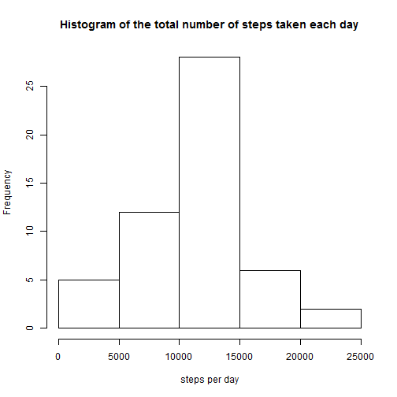
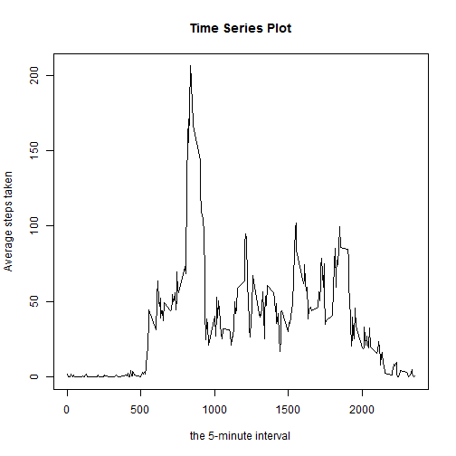
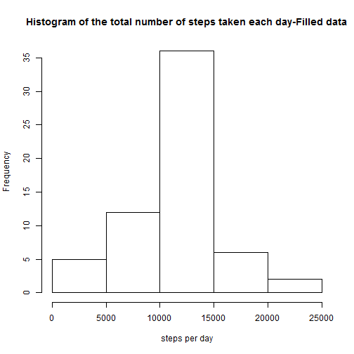
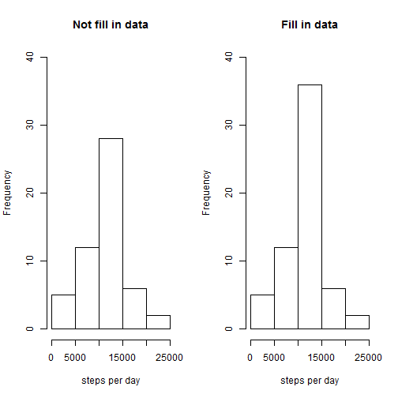
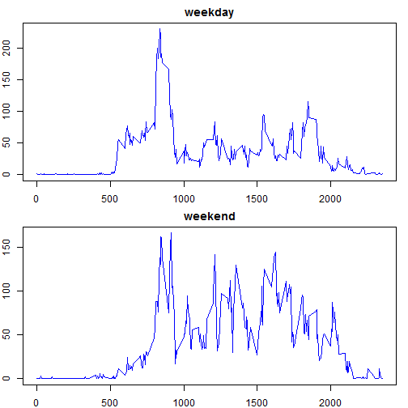

This is an R Markdown document. Markdown is a simple formatting syntax for authoring HTML, PDF, and MS Word documents. For more details on using R Markdown see <http://rmarkdown.rstudio.com>.

When you click the **Knit** button a document will be generated that includes both content as well as the output of any embedded R code chunks within the document. You can embed an R code chunk like this:

Load Data and transform data into suitable format

```r
data     <- read.csv("C:/Users/KK/Documents/Outside Learning/Specialization-Data Science/05_Reproducible research/Project01/activity.csv")
data[,2]   <- as.Date(data[,2])
```

Calculate the total number of steps taken per day

```r
missing    <- which(is.na(data[,1]) == TRUE)
#data.NOmiss<- data[-missing,]#ignore missing value in dataset
s1         <- aggregate(steps ~ date, data=data, sum)
```

Make a histogram of the total number of steps taken each day

```r
hist(s1[,2], main="Histogram of the total number of steps taken each day",cex=0.6, xlab="steps per day")
```

 

Calculate and report the mean and median of the total number of steps taken per day

```r
options(digits=12)
summ <- summary(s1[,2])
print(paste('Mean(steps/d):',summ[4],'Median(steps/d):',summ[3]))
```

```
## [1] "Mean(steps/d): 10766.1887 Median(steps/d): 10765"
```

What is the average daily activity pattern?
Make a time series plot (i.e. type = "l") of the 5-minute interval (x-axis) and the average number of steps taken, averaged across all days (y-axis)

```r
s2         <- aggregate(steps ~ interval, data = data, mean)
plot(s2[,1],s2[,2],type='l', main='Time Series Plot', xlab='the 5-minute interval',ylab='Average steps taken')
```

 

Which 5-minute interval, on average across all the days in the dataset, contains the maximum number of steps?

```r
Max.interval <- which.max(s2[,2])
print(paste('Interval with maximum number of steps:',s2[Max.interval,1]))
```

```
## [1] "Interval with maximum number of steps: 835"
```

Imputing missing values
Calculate and report the total number of missing values in the dataset (i.e. the total number of rows with NAs)

```r
missing    <- which(is.na(data[,1]) == TRUE)
print(paste('Total number of missing values:',length(missing)))
```

```
## [1] "Total number of missing values: 2304"
```

Devise a strategy for filling in all of the missing values in the dataset. Use mean for that 5-minute interval to fill in the missing value.
Create a new dataset that is equal to the original dataset but with the missing data filled in.

```r
int.missing      <- data[missing,3]
rowint           <- match(int.missing, s2[,1])
replace          <- s2[rowint,2]
data.fill        <- data
data.fill[missing,1]  <- replace
```

Make a histogram of the total number of steps taken each day and Calculate and report the mean and median total number of steps taken per day.

```r
s3   <- aggregate(steps ~ date, data = data.fill, sum)
hist(s3[,2], main="Histogram of the total number of steps taken each day-Filled data",cex=0.6, xlab="steps per day")
```

 

Comparing histogram

```r
par(mfrow = c(1, 2))
hist(s1[,2], main="Not fill in data",cex=0.6, xlab="steps per day",ylim=range(0,40))
hist(s3[,2], main="Fill in data",cex=0.6, xlab="steps per day",ylim=range(0,40))
```

 

```r
print(paste('Imputing missing data with mean of the 5-minute interval leads to the histogram with more concentrated data in the range of 10,000 - 15,000 steps per day'))
```

```
## [1] "Imputing missing data with mean of the 5-minute interval leads to the histogram with more concentrated data in the range of 10,000 - 15,000 steps per day"
```

Are there differences in activity patterns between weekdays and weekends?
Create a new factor variable in the dataset with two levels - "weekday" and "weekend" indicating whether a given date is a weekday or weekend day

```r
days  <- weekdays(data.fill[,2])
Wknd  <- which(days %in% c("Saturday","Sunday"))
data.fill[Wknd,4]       <- "weekend" 
data.fill[-Wknd,4]      <- "weekday"
colnames(data.fill)[4]  <- "day"
data.fill[,4]           <-as.factor(data.fill[,4])
```

Make a panel plot containing a time series plot (i.e. type = "l") of the 5-minute interval (x-axis) and the average number of steps taken, averaged across all weekday days or weekend days (y-axis). 

```r
s4 <- split(data.fill, data.fill$day)
wd <- aggregate(steps ~ interval, data = s4[[1]], mean)
we <- aggregate(steps ~ interval, data = s4[[2]], mean)
par(mfrow = c(2, 1), mar = c(2, 2, 2, 1))
plot(wd[,1],wd[,2],main='weekday',xlab='interval',ylab='Number of steps',type='l',col='blue')
plot(we[,1],we[,2],main='weekend',xlab='interval',ylab='Number of steps',type='l',col='blue')
```

 
